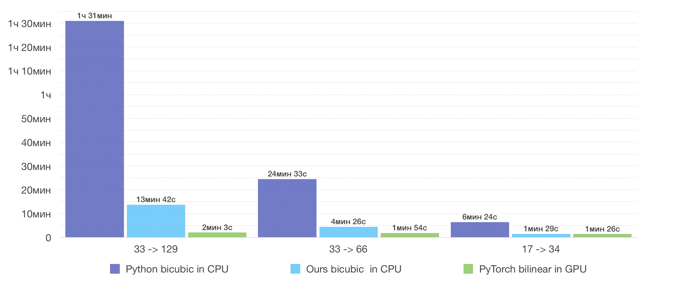

# PyTorch-Bicubic-interpolation
## Introduction

**Bicubic interpolation for PyTorch**
In PyTorch don't have Bicubic interpolation. Therefore, I considered several options for the implementation of the project.
The goal is to get a speed close to the [PyTorch bilinear interpolation](https://pytorch.org/docs/stable/nn.html#torch-nn-functional).

## How to Run

This code is written in Python 3.6

```
# Use pip for python 2.7 and pip3 for python 3.6

pip3 install torch torchvision
pip3 install numpy
pip3 install numba
```

## Results

<center>
    <figure>
        
        <figcaption>
        </figcaption>
    </figure>
</center>
